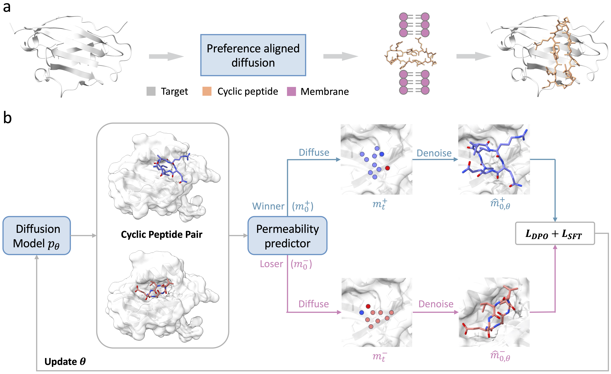

# CycDiff-DPO

CycDiff-DPO uses preference-aligned diffusion to design target-specific macrocyclic peptides with enhanced membrane permeability, balancing binding competence and cell permeability in one framework.



---

## Table of Contents

- [Setup](#setup)
- [Quick Start](#quick-start)
- [Training from Scratch](#training-from-scratch)
- [Preference Pairs Construction](#preference-pairs-construction)
- [Permeability Predictor Training](#permeability-predictor-training)

---

## Setup

### Environment

```bash
conda env create -f env.yaml
conda activate CycDiff_DPO
```

> **Note:** This environment uses **Python 3.9.19**.

### Data Download

Download datasets and pre-trained models from Zenodo:

```bash
# Download checkpoints
wget https://zenodo.org/records/19429073/files/ckpts.tar.gz?download=1 -O ./ckpts.tar.gz
tar -xzf ./ckpts.tar.gz && rm ./ckpts.tar.gz

# Download train_valid dataset (for training DPO)
wget https://zenodo.org/records/19429955/files/train_valid.tar.gz?download=1 -O ./datasets/train_valid.tar.gz
tar -xzf ./datasets/train_valid.tar.gz -C ./datasets/ && rm ./datasets/train_valid.tar.gz

# Download LNR_CPSea dataset
wget https://zenodo.org/records/19429073/files/LNR_CPSea.tar.gz?download=1 -O ./datasets/LNR_CPSea.tar.gz
tar -xzf ./datasets/LNR_CPSea.tar.gz -C ./datasets/ && rm ./datasets/LNR_CPSea.tar.gz

# Download SciBERT model
wget https://zenodo.org/records/19429073/files/scibert_model.tar.gz?download=1 -O ./scibert_model.tar.gz
tar -xzf ./scibert_model.tar.gz && rm ./scibert_model.tar.gz
```

### Pre-trained Weights

The following weights are included in this repository:

| File | Description |
|------|-------------|
| `./ckpts/base_model.ckpt` | Base model from CP-Composer |
| `./ckpts/autoencoder.pth` | Pre-trained full-atom autoencoder (from PepGLAD) |
| `./ckpts/dpo/epoch44_step513090.ckpt` | **DPO-fine-tuned model** (final checkpoint) |
| `./ckpts/xgboost_ensemble/` | XGBoost ensemble for membrane permeability prediction |
| `./datasets/train_valid/generated_pairs.pkl` | Pre-generated DPO preference pairs |

---

## Quick Start

The full pipeline consists of three steps. Default: 5 samples per target on the LNR_CPSea test set.

### Step 1: Generation

```bash
conda activate CycDiff_DPO
GPU=0 bash scripts/inference_forw.sh
```

### Step 2: Filter

```bash
bash scripts/filter_success.sh ./results/LNR_CPSea/condition2_w5_5samples/results.jsonl
```

### Step 3: Postprocessing

```bash
INPUT_DIR=./results/LNR_CPSea/condition2_w5_5samples/candidates
OUTPUT_DIR=./results/LNR_CPSea/condition2_w5_5samples/relaxed
NUM_CORES=10 bash scripts/batch_relax_good_results.sh
```

---

## Training from Scratch

DPO training fine-tunes the pre-trained LDM to align with membrane permeability preferences. We provide the pre-generated preference pairs and the trained DPO model. To train from scratch:

```bash
conda activate CycDiff_DPO
GPU=0 bash scripts/train.sh
```

---

## Preference Pairs Construction

Preference pairs are used to train the DPO model. We provide pre-generated pairs at `./datasets/train_valid/generated_pairs.pkl`.

To regenerate pairs with a custom permeability predictor, run:

```bash
bash scripts/run_build_pairs_xgboost.sh
```

This requires the training PDB structures. Download and place them in:

```bash
./datasets/train_valid/pdbs/   # Reference PDB structures
```

---

## Permeability Predictor Training

We provide the trained XGBoost ensemble at `./ckpts/xgboost_ensemble/`, which includes:

- `model_*.pkl` — 10 individual XGBoost models
- `scaler.pkl` — feature scaler
- `extractor.pkl` — ECFP + descriptor feature extractor
- `config.json` — ensemble configuration

To retrain from scratch using Caco-2 permeability data at `./datasets/caco2/caco2_dedup.csv`:

```bash
bash scripts/train_xgb.sh
```
